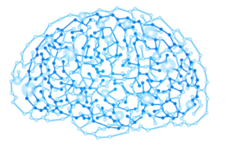

[](https://github.com/HorebParraud/Need4Stek/graphs/contributors)
[](https://github.com/HorebParraud/Need4Stek/network)
[](https://github.com/HorebParraud/Need4Stek/stargazers)
[](https://github.com/HorebParraud/Need4Stek/issues)
[](https://github.com/HorebParraud/Need4Stek)
[![LinkedIn][linkedin-shield]][linkedin-url]

<!-- PROJECT LOGO -->
<br />
<p align="center">
  <a>
    
  </a>

  <h1 align="center">Need4Stek</h1>

  <p align="center">
    EPITECH project - Artificial Intelligence
    <br />
    <br />
    <a href="https://github.com/HorepParraud/Need4Stek/issues">Report Bug</a>
    ·
    <a href="https://github.com/HorebParraud/Need4Stek/issues">Request Feature</a>
  </p>
</p>


<!-- IMPORTANT -->
## Important!
**If you are seeing this repository, please just star it! It will not take much time! :)**

<!-- ABOUT THE PROJECT -->
## About The Project
The goal of this project is to create an autonomous car. It must be capable of driving on a track without hitting the walls or driving in the wrong direction.

For this we have at our disposal:

- CoppeliaSim, a simulator created by Coppelia Robotics. It allows to create and control robots.
For this project, we use virtual tracks and a virtual car that will be controlled by our AI.

- an API (binary name: `n4s`). It's a communication interface that proposes a set of actions that we can use. It can be used alone to
to test the command line communication protocol.

- a shell script (binary name: `pipes.sh`) that connects the program to the API and runs
simulations. it is the binary to be executed once the program has been compiled.


## Commands
The communication is done via a text-type protocol
| Command | Value range | answer type |
| --- | :-: | :-: |
|START_SIMULATION   |   -   |(1)|
|STOP_SIMULATION    |   -   |(1)|
|CAR_FORWARD:float  | [0;1] |(1)|
|CAR_BACKWARDS:float| [0;1] |(1)|
|WHEELS_DIR:float   |[-1;1] |(1)|
|GET_INFO_LIDAR     |   -   |(2)|
|GET_CURRENT_SPEED  |   -   |(3)|
|GET_CURRENT_WHEELS |   -   |(3)|
|CYCLE_WAIT:int     |[0; INT_MAX]|(3)|
|GET_CAR_SPEED_MAX  |   -   |(3)|
|GET_CAR_SPEED_MIN  |   -   |(3)|
|GET_INFO_SIMTIME   |   -   |(4)|

Here are the different answer formats, corresponding to each type:
- (1): `VALUE_ID:STATUS:CODE_STR:ADDITIONNAL_INFO`
- (2): `VALUE_ID:STATUS:CODE_STR[:float]*32:ADDITIONNAL_INFO`
- (3): `VALUE_ID:STATUS:CODE_STR:float:ADDITIONNAL_INFO`
- (4): `VALUE_ID:STATUS:CODE_STR:[long,long]:ADDITIONNAL_INFO`

### Built With
* Makefile using gcc

<!-- GETTING STARTED -->
## Getting Started
To get a local copy up and running follow these simple steps.

### Prerequisites
Clone the repositorie. On the root download and extract `CoppeliaSim`
```sh
wget https://www.coppeliarobotics.com/files/CoppeliaSim_Edu_V4_0_0_Ubuntu18_04.tar.xz

tar xvf CoppeliaSim_Edu_V4_0_0_Ubuntu18_04.tar.xz
```
Start `CoppeliaSim` with
```sh
./CoppeliaSim_Edu_V4_0_0_Ubuntu18_04/coppeliaSim.sh
```
Once the launched software loads a scene in `File` > `Open scene...` > `anyscene.ttt`
*(Scenes are stored in `n4s_paquage/scene`)*

Run the ai with `pipes.sh`
```sh
make
./pipes.sh
```

<!--USEFULL LINKS-->
##
[![LinkedIn][linkedin-shield]][linkedin-url] [![GitHub][github-shield]][github-url]

<!-- MARKDOWN LINKS, ALIAS & IMAGES -->
[linkedin-shield]: https://img.shields.io/badge/-LinkedIn-black.svg?style=for-the-badge&logo=linkedin&colorB=555
[linkedin-url]: https://www.linkedin.com/in/horeb-parraud/
[github-shield]: https://img.shields.io/badge/-other_repositories-black.svg?style=for-the-badge&logo=github&colorB=555
[github-url]: https://github.com/HorebParraud?tab=repositories
